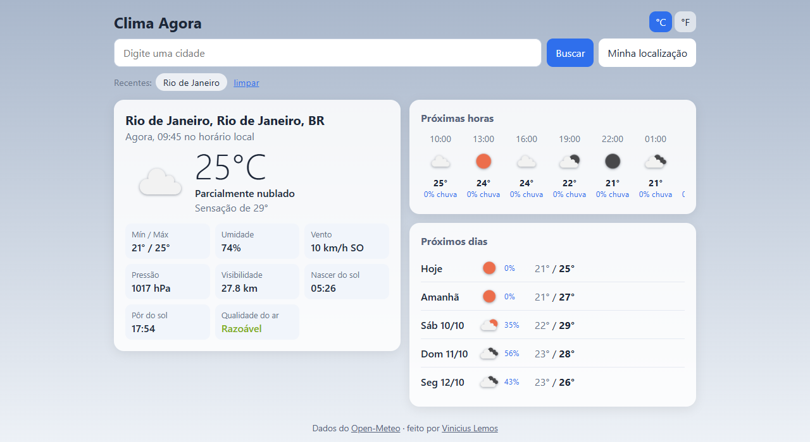
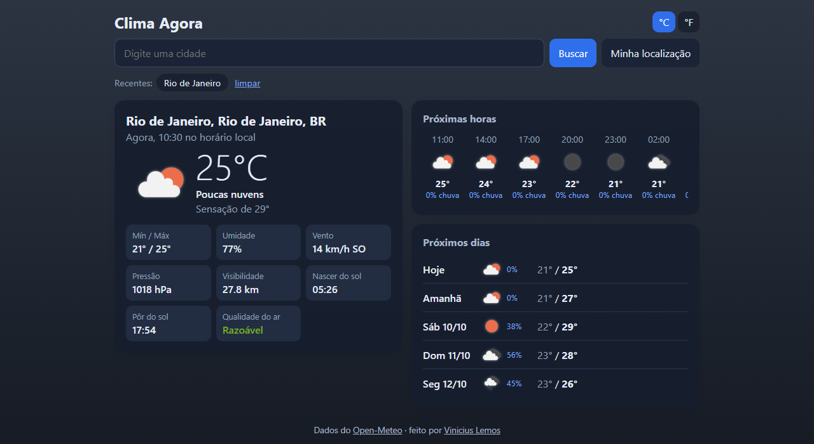
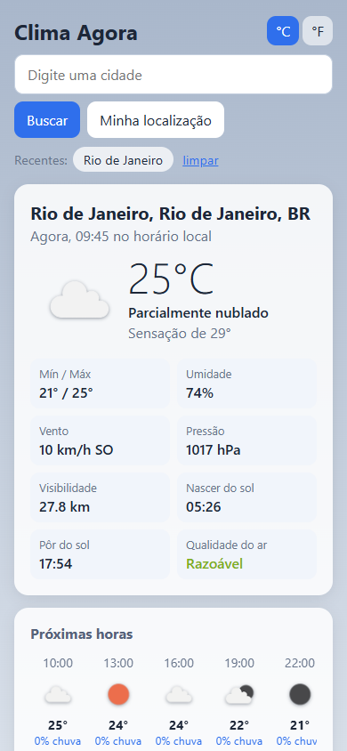

# Clima Agora


App de previsão do tempo feito em React + Node. Você digita uma cidade (ou usa sua localização) e ele mostra o clima de agora, as próximas horas, os próximos 5 dias e a qualidade do ar.

**Dá pra usar aqui:** https://clima-agora-g5jz.onrender.com

Tá hospedado no plano grátis do Render, que desliga o servidor depois de um tempo sem acesso. Se for o primeiro acesso em um tempo, a página pode levar uns 50 segundos pra abrir. Depois disso fica rápido.



Os dados vêm da API da [OpenWeather](https://openweathermap.org/api). Fiz principalmente pra praticar React consumindo uma API de verdade.

## Por que tem um servidor

A OpenWeather precisa de uma chave, e se eu chamasse a API direto do React a chave ia ficar visível pra qualquer um no navegador. Então o front chama o meu servidor (Express), e ele chama a OpenWeather.

Já que ia ter servidor mesmo, aproveitei pra:
- juntar as 3 chamadas (tempo atual, previsão e qualidade do ar) numa só
- guardar as respostas por 10 minutos, pra não gastar o limite do plano grátis
- limitar as requisições por IP com o `express-rate-limit`

## Rodando

Precisa do Node 20+.

```bash
git clone https://github.com/ViniciuscLemos/clima-agora
cd clima-agora
npm install
npm run dev
```

Abre em http://localhost:5173.

Já funciona sem configurar nada: sem chave da OpenWeather, o servidor usa o [Open-Meteo](https://open-meteo.com/), que é grátis e não pede chave (e o Nominatim do OpenStreetMap pra achar o nome da cidade pela localização). Converti as respostas dele pro mesmo formato da OpenWeather, então o resto do código é igual pros dois.

Pra usar a OpenWeather:

1. cria uma conta grátis na [OpenWeather](https://home.openweathermap.org/users/sign_up) e copia sua chave
2. copia o `server/.env.example` pra `server/.env` e cola a chave lá

A chave nova pode demorar umas 2 horas pra começar a funcionar.

O deploy no Render tá configurado no `render.yaml`: ele monta o React, sobe o Express e usa a rota `/api/saude` pra saber se o app subiu. Cada push na `main` atualiza o site sozinho.

Pra rodar a versão de produção no seu computador:

```bash
npm run build
npm start
```

Aí o próprio servidor entrega o site em http://localhost:3001.

## Testes

```bash
npm test
```

## O que tem

- busca com sugestões enquanto digita (dá pra escolher com as setas e Enter)
- botão de usar a localização do navegador
- °C ou °F (fica salvo)
- últimas cidades pesquisadas
- horários sempre no fuso da cidade (se pesquisar Tóquio, o pôr do sol aparece no horário de lá)
- o fundo muda se tá sol, nublado, chovendo ou de noite
- modo escuro, que segue o tema do sistema

No modo escuro:



No celular fica assim:


