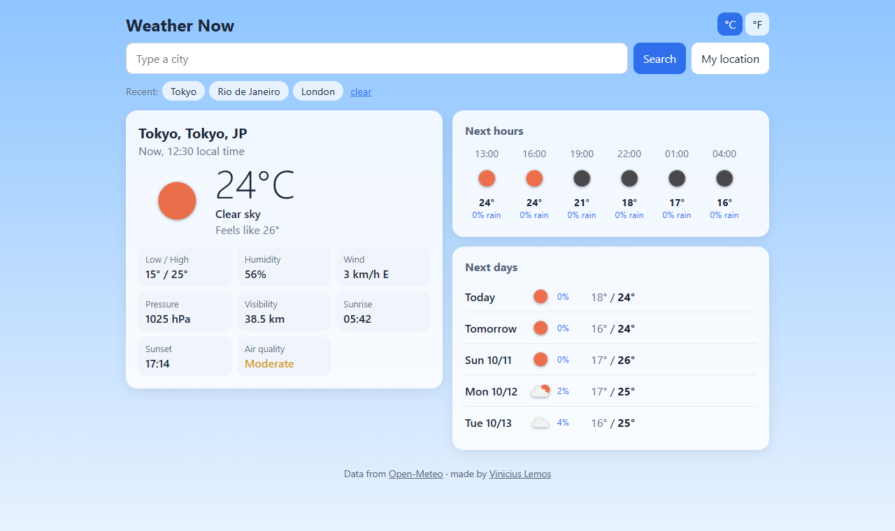
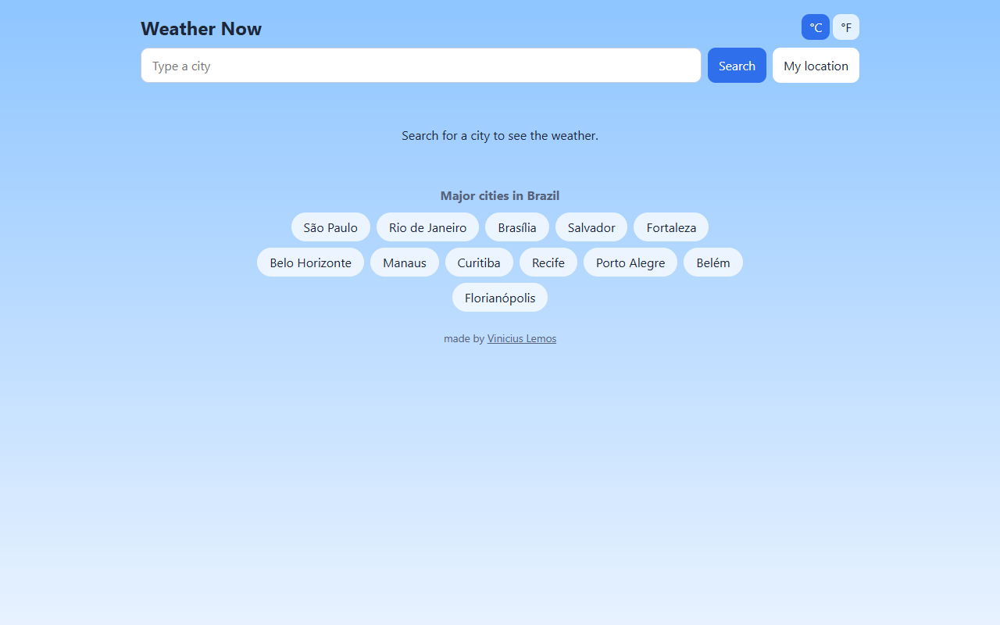
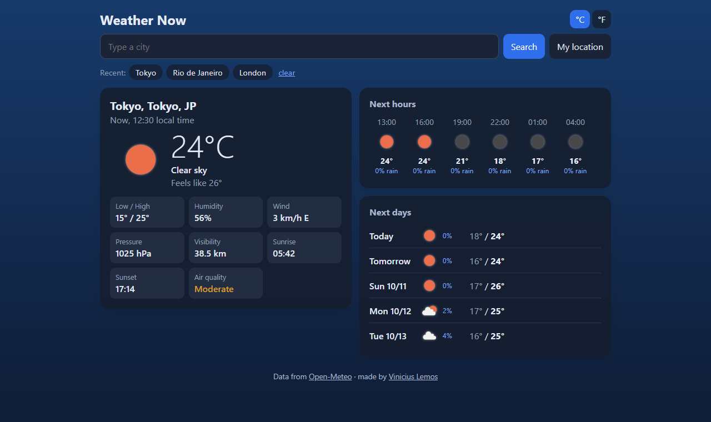
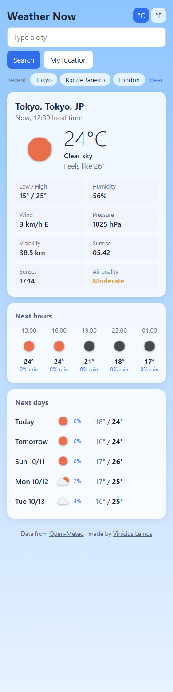

# Weather Now


A weather forecast app built with React + Node. You type a city (or use your location) and it shows the current weather, the next hours, the next 5 days and the air quality.

**Try it here:** https://clima-agora-g5jz.onrender.com

It's hosted on Render's free plan, which shuts the server down after a while without visits. If nobody opened it in a while, the page can take about 50 seconds to load. After that it's fast.



The data comes from the [OpenWeather](https://openweathermap.org/api) API (or Open-Meteo, more on that below). I made it mainly to practice React talking to a real API.

## Why there's a server

OpenWeather needs a key, and if I called the API straight from React the key would be visible to anyone in the browser. So the front end calls my server (Express), and the server calls OpenWeather.

Since there was going to be a server anyway, I used it to:
- merge the 3 calls (current weather, forecast and air quality) into one
- cache the responses for 10 minutes, so I don't burn through the free plan limit
- rate limit requests per IP with `express-rate-limit`

## Running

You need Node 20+.

```bash
git clone https://github.com/ViniciuscLemos/weather-now
cd weather-now
npm install
npm run dev
```

It opens at http://localhost:5173.

It works without setting anything up: with no OpenWeather key, the server uses [Open-Meteo](https://open-meteo.com/), which is free and needs no key (and OpenStreetMap's Nominatim to find the city name from your location). I convert its responses to the same format as OpenWeather, so the rest of the code is the same for both.

To use OpenWeather:

1. create a free account at [OpenWeather](https://home.openweathermap.org/users/sign_up) and copy your key
2. copy `server/.env.example` to `server/.env` and paste the key there

A new key can take about 2 hours to start working.

The Render deploy is set up in `render.yaml`: it builds React, starts Express and uses the `/api/health` route to know the app is up. Every push to `main` updates the site on its own.

To run the production version on your computer:

```bash
npm run build
npm start
```

Then the server itself serves the site at http://localhost:3001.

## Tests

```bash
npm test
```

## Features

- search with suggestions while you type (you can pick one with the arrow keys and Enter)
- a button to use the browser's location
- shortcuts to the major cities in Brazil on the home screen
- °C or °F (it's remembered)
- recently searched cities
- times always in the city's timezone (if you search Tokyo, the sunset shows Tokyo's time)
- the background changes if it's sunny, cloudy, raining or night
- dark mode, which follows the system theme

The home screen and dark mode:

<p>
  
  
</p>

On the phone it looks like this:



## Structure

```
server/
  src/app.js           Express routes and cache
  src/openweather.js   OpenWeather client
  src/openmeteo.js     Open-Meteo client (converts to the OpenWeather format)
  src/transform.js     keeps only what the front end uses
web/
  src/App.jsx          main state
  src/components/      Search, BrazilCities, CurrentWeather, Forecast
  src/utils/format.js  times, temperatures, wind
```
